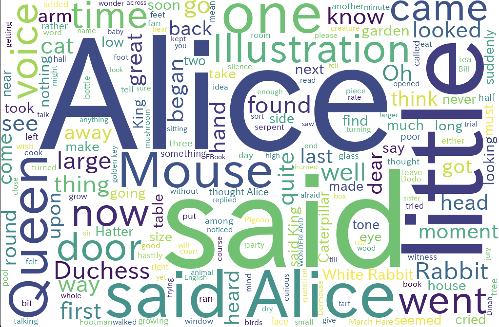

# WordCloud

## 準備

1. Tcl/Tk インストール (必要な場合のみ)

WordCloud の描画で Tcl/Tk が必要です。

コマンドラインから `python -m tkinter` で失敗する場合，入っていないのでインストールしてください。

Mac

```
$ brew install tcl-tk
```

Windows

[このあたり](http://www.geocities.jp/m_hiroi/tcl_tk.html) を参考にインストールしてください。

(インストール後，virtualenv の再作成が必要かも)

2. [matplotlib](https://matplotlib.org/), [wordcloud](https://github.com/amueller/word_cloud) をインストール

```
(venv) hands-on$ pip install matplotlib
(venv) hands-on$ pip install wordcloud
```

3. IPA フォントの入手

WordCloud の日本語化で使います。

[ここ](https://ipafont.ipa.go.jp/old/ipafont/download.html) からTTFファイル「IPA P ゴシック」をダウンロードして，`ipagp.ttf` ファイルを `hands-on/02_wordcloud` ディレクトリにコピーしてください。


## 英語のテキストから WordCloud を作る

```
(venv) 02_wordcloud$ view ../data/alice_utf8.txt
(venv) 02_wordcloud$ python wordcloud_en.py ../data/alice_utf8.txt
```

こういう画像が表示されたら成功です。



## 日本語のテキストで WordCloud を作る (1)

```
(venv) 02_wordcloud$ view ../data/kazeno_matasaburo_utf8.txt
(venv) 02_wordcloud$ python wordcloud_en.py ../data/kazeno_matasaburo_utf8.txt
```

どうでしょうか...ダメな感じですね！

## 日本語のテキストで WordCloud を作る (2)

**ハンズオン課題 2-1**

`WordCloud.generate()` メソッドの入力には，スペースで単語を区切った文字列を渡す必要があります。

`wordcloud_ja.py` の `split_text()` メソッドを完成させて，日本語テキストから WordCloud を作成できるようにしてください。

```
$ python wordcloud_ja.py ../data/kazeno_matasaburo_utf8.txt
```

できたら，`data` ディレクトリ内の他のテキストの WordCloud も試してください。

※ (＋α) MeCab が使える方は，MeCab + mecab-python3 で書き換えてみてください。
