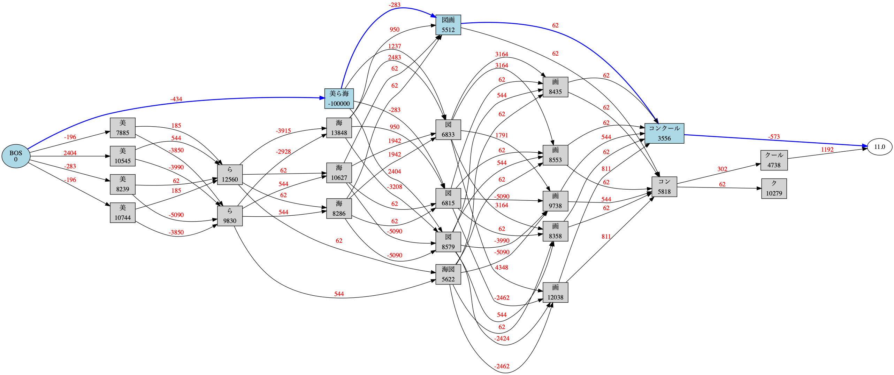

## 1-1

表層形は `Token.surface` で取り出せる。

```
In [2]: for token in Tokenizer().tokenize('今日も１日がんばるぞい'):
   ...:     print(token.surface)
   ...:
今日
も
１
日
がんばる
ぞい
```

## 1-2

基本形は `Token.base_form` で取り出せる。

```
In [3]: for token in Tokenizer().tokenize('今日も１日がんばった'):
   ...:     print(token.base_form)
   ...:
今日
も
１
日
がんばる
た
```

## 1-3

`simpledic` フォーマットの辞書を使う場合。

```
(venv) 01_getstarted$ cat udic.csv
美ら海,名詞,チュラウミ
(venv) 01_getstarted$ echo "美ら海図画コンクール" | janome -g --udic udic.csv --udic-type simpledic
美ら海	名詞,*,*,*,*,*,美ら海,チュラウミ,チュラウミ
図画	名詞,一般,*,*,*,*,図画,ズガ,ズガ
コンクール	名詞,一般,*,*,*,*,コンクール,コンクール,コンクール
Graph was successfully output to lattice.gv.png
```

